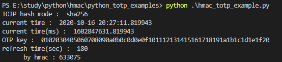
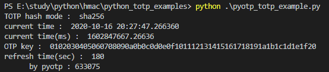
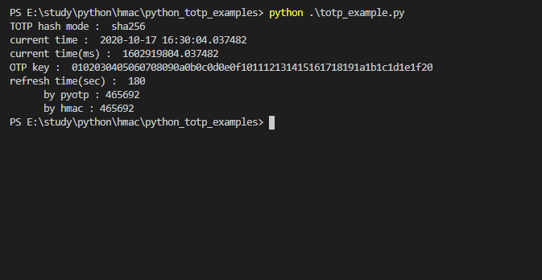

# python totp exampels
  

## HMAC을 이용한 TOTP
코드 파일 명 : hmac_totp_example.py

실행 방법 : 

    > python hmac_totp_example.py

### 결과 

  

## pyotp를 이용한 TOTP
코드 파일 명 : pyotp_totp_example.py

실행 방법 : 

    > pip install pyotp   # pyotp 모듈 설치 필요
    > python pyotp_totp_example.py

### 결과 

  

## pyotp와 hmac 모두 테스트

코드 파일 명 : totp_example.py

추가 필요 파일 :

    pyotp_totp_example.py
    hmac_totp_example.py

실행 방법 : 

    > pip install pyotp   # pyotp 모듈 설치 필요
    > python totp_example.py

### 결과 

